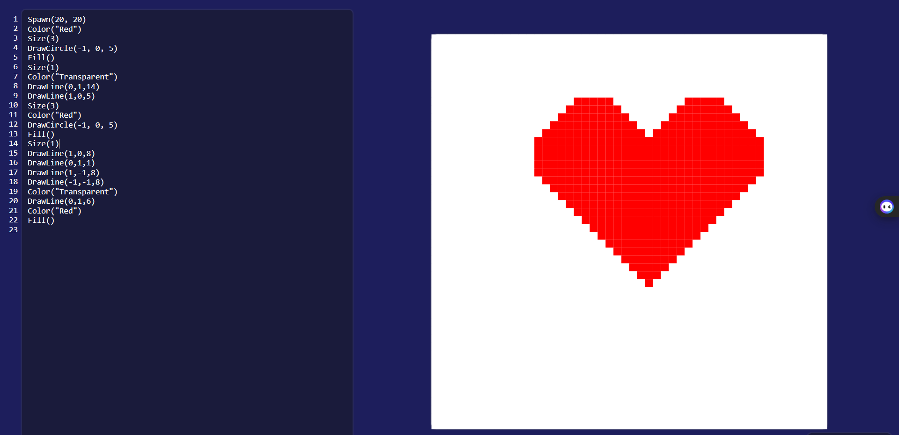
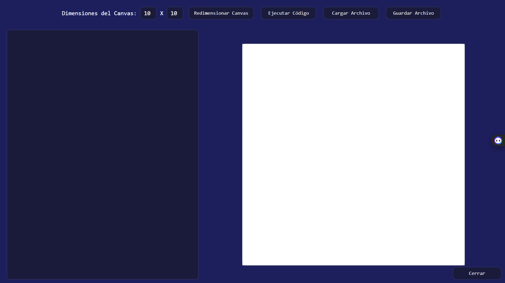

# PIXEL WALL-E 🚀🎨

¡Bienvenido a **Pixel Wall-E**, un proyecto interactivo que combina programación, diseño y creatividad! Este proyecto permite a los usuarios escribir código para controlar un robot virtual llamado **Wall-E**, que puede pintar en un lienzo cuadriculado. Es una herramienta educativa y divertida para aprender conceptos de programación, como análisis léxico, sintaxis, semántica y ejecución de instrucciones.

---

## 🛠️ Tecnologías utilizadas

- **C#**: Lenguaje principal del proyecto.
- **WPF (Windows Presentation Foundation)**: Para la interfaz gráfica interactiva.
- **Patrones de diseño**: Uso de patrones como **Visitor**, **Scope** y **Singleton** para estructurar el intérprete.
- **.NET 8.0**: Framework base para el desarrollo.

---

## 🌟 Características principales

1. **Editor de código integrado**: Escribe y ejecuta código directamente en la aplicación.
2. **Lienzo interactivo**: Visualiza cómo Wall-E pinta en un lienzo cuadriculado.
3. **Soporte para funciones personalizadas**: Define y ejecuta funciones para controlar el comportamiento de Wall-E.
4. **Validación semántica y sintáctica**: Detecta errores en tiempo de ejecución y en la fase de análisis.

---

## 📂 Estructura del proyecto

El proyecto está dividido en varias clases y módulos clave que implementan el intérprete. A continuación, se describen las partes más importantes:

---

### 🔑 **Clases principales**

#### 1. **Token**
La clase `Token` representa las unidades léxicas del lenguaje. Cada token tiene un tipo y un valor asociado, así como la línea y columna asociada.

```csharp
public class Token 
{ 
    public enum TokenType 
    { 
       Plus, 
       Minus, 
       Times, 
       Divide, 
       Pow, 
       Module, 
       LessThan, 
       GreaterThan, 
       Equal, // Operadores 
       GetActualX, 
       GetActualY, 
       GetCanvasSize, // Funciones 
       // Otros 
    }
    public TokenType Type { get; set; }
    public string Value { get; set; }
    public int Line { get; set; }
    public int Column { get; set; }

    public Token(TokenType Type, string Value, int Line, int Column)
    {
       this.Type = Type;
       this.Value = Value;
       this.Line = Line;
       this.Column = Column;
    }	
```


- **Uso**: Los tokens son generados por el **Lexer** y consumidos por el **Parser** para construir el árbol de sintaxis.

---

#### 2. **Lexer**
El **Lexer** (analizador léxico) convierte el código fuente en una lista de tokens. Es el primer paso en el proceso de interpretación. Esta clase utiliza la expresiones regulares del espacio de nombres **System.Text.RegularExpressions** para ayudar a separar de forma más dinámica las palabras principales para convertirlas en Tokens.

```csharp
   
  public class Lexer
  {
       private static Dictionary<string, Token.TokenType> KeyWords = new Dictionary<string, Token.TokenType>()
       {
           //Diccionario que tiene como clave un string y como valor un Token.TokenType
       }
       private string[]? code;
       private List<Token> tokensList;
       public string[] Code { get; private set; }
       public Token[] GetLexer()
       {
           //Método principal que convierte el array de string en un array de Token
       }
  }

```

- **Responsabilidad**: Identificar palabras clave, operadores y otros elementos del lenguaje.

---

#### 3. **Parser**
El **Parser** (analizador sintáctico) toma los tokens generados por el Lexer y construye un árbol de sintaxis abstracta (AST). Esta clase contiene además de los métodos para construir los nodos, métodos para realizar la validación del lenguaje, también contiene propiedades para el índice del array de Tokens que esta recorriendo.

```csharp

    public class Parser : IParsing
    {
        private Token[] Tokens { get; }
        private Token? CurrentToken { get; set; }
        private int Index { get; set; }
        private bool DetectorError = false;

        //Builder
        public Parser(Token[] tokens)
        {
            Tokens = tokens;
            CurrentToken = null;
            Index = -1;
        }
	private void Match(params Token.TokenType?[] nextTokens)
        {
    	    //Avanza en el orden de parámetros de entrada	
        }
	public ProgramCompiler Parsing()
        {
            //Construye el nodo principal del AST
        }
    }

```

- **Responsabilidad**: Validar la estructura del código y preparar el AST para la ejecución.

---

#### 4. **Scope**
El **Scope** (ámbito o alcance) es una estructura que almacena variables y funciones definidas en el programa. Permite manejar el contexto de ejecución. Este es el pilar principal del Chequeo Semántico de cada nodo del árbol para asegurase que sea válido semánticamente antes de la evaluación. Esta estructura se maneja con el uso de una interfaz para que sea más dinámica a la hora de hacer el chequeo por cada nodo dado que son clases diferentes.

```csharp

public interface ICheckSemantic
{
    public bool CheckSemantic(IScope scope);
}
public interface IScope
{
    //Properties
    public IScope? Parent { get; set; } //Padre de este objeto en el arbol del Scope
    public Dictionary<string, Statement?> Defined { get; set; } //Variables almacenadas nombres y valores

    // Methods
    public bool IsDefined(string? search);                                  // Verifica si la variable está almacenada
    public void Define(Variable variable);                                  // Agrega la variable
    public IScope CreateChild();                                            // Retorna un nuevo hijo de este Scope
    public Utils.ReturnType? GetType(string? search, IScope scope);         // Retorna el tipo de variable (String, Bool, Digit)
}

```
- **Uso**: Gestiona variables y su visibilidad en diferentes niveles del programa.

---

#### 5. **Visitor**
El patrón **Visitor** se utiliza para recorrer y evaluar el AST generado por el Parser. Este es crucial para la evaluación del AST debido a que al aprovechar la máscara de la estructura del **Scope** permite actualizar de forma dinámica las variables a medida que se van evaluando.
 
```csharp

public interface IVisitor
{
    // Properties
    public IVisitor? Parent { get; set; }                                   // Padre de este objeto en el árbol de Visitor
    public IScope? Scope { get; set; }                                      // Scope asociado al alcance (Máscara)
    public Dictionary<string, object> Defined { get; set; }                 // Variables almacenadas (nombre y valores)
    public List<string> IncreaseVariables { get; set; }                     // Variables a incrementadas dentro del alcance

    // Methods
    public bool IsDefined(string search);                                   // Verifica si la variable está almacenada
    public void Define(Variable variable);                                  // Agrega la variable
    public void Define(string? name, object? value);                        // Agrega la variable (nombre y valor)
    public object? GetValue(string? search);                                // Devuelve el valor específico de un tipo (variable)
    public IVisitor CreateChild();                                          // Retorna un nuevo hijo de este Visitor
    public IVisitor CreateChild(IScope? scope);                             // Retorna un hijo de este objeto y le asigna un Scope
    public void AddInstance();                                              // Agrega las variables del Scope
}
    	
```
#### **Evaluación**

Con el código válido sintáctica y semánticamente se puede comenzar el proceso de evaluación del AST, cada nodo del tiene su propio método evaluate que recibe como parámetro un IVisitor entre las principales estructuras que se evalúan se encuentran las instrucciones, las funciones, las declaraciones, y las expresiones aritméticas y booleanas. En la evaluación de instrucciones se encuentran las que permiten dibujar sobre el canvas. 


### Código de ejemplo:

```csharp

public abstract class Instructions
{
    public abstract bool CheckSemantic(IScope scope);
    public abstract void Evaluate(IVisitor visitor);
}

public class DrawLine : Instructions
{
    // Propiedades y métodos de la clase
    
    public override void Evaluate(IVisitor visitor)
    {
       double x, y, distance;

       if (DirX != null && DirY != null && Distance != null)
       {
           x = Convert.ToDouble(DirX.Evaluate(visitor.Scope,visitor));
           y = Convert.ToDouble(DirY.Evaluate(visitor.Scope,visitor));
           distance = Convert.ToDouble(Distance.Evaluate(visitor.Scope, visitor));

           int currX = Utils.wall_E.PosX;
           int currY = Utils.wall_E.PosY;

           for (int step = 0; step < (int)distance; step++)
           {
               if (Utils.CheckRange(currX, currY))
               {
                   Utils.PaintBrush(currX, currY);
                   Utils.ChangeCellColor(currX, currY, Utils.wall_E.PaintBrush);
                   currX += (int)x;
                   currY += (int)y;
               }
           }
           if(!Utils.CheckRange(currX, currY))
              throw new Exception($"Error en tiempo de ejecución: La posición final de Wall-E ({currX}, {currY}) está fuera de los límites del canvas.");
           Utils.PaintBrush(currX, currY);
           Utils.wall_E.PosX = currX;
           Utils.wall_E.PosY = currY;
        }  
    } 	
} 

```

---

## 🎨 Interfaz gráfica

La interfaz gráfica está diseñada en **WPF** y permite a los usuarios interactuar con el lienzo y el editor de código.

### Ejemplo de XAML para el lienzo y el editor:

```XAML
<!-- Canvas cuadriculado -->
<Grid Grid.Row="1" Grid.Column="1" Margin="10" HorizontalAlignment="Center" VerticalAlignment="Center">
    <Border Background="White" Width="680" Height="680" BorderBrush="#2A2B5C" BorderThickness="2" CornerRadius="10">
        <Grid Name="CanvasGrid" ShowGridLines="False">
            <!-- Las filas y columnas del canvas se generarán dinámicamente en el código detrás -->
        </Grid>
    </Border>
</Grid>
```

## 🚀 Ejemplo de uso

### Código de ejemplo:

```
Spawn(20, 20) 
Color("Red") 
Size(3) 
DrawCircle(-1, 0, 5)
Fill()
Size(1)
Color("Transparent")
DrawLine(0,1,14)
DrawLine(1,0,5)
Size(3)
Color("Red")  
DrawCircle(-1, 0, 5)
Fill() 
Size(1)
DrawLine(1,0,8)
DrawLine(0,1,1)
DrawLine(1,-1,8)
DrawLine(-1,-1,8)
Color("Transparent")
DrawLine(0,1,6)
Color("Red")
Fill()

```

Este código pinta un corazón en el canvas de color rojo, este canvas debe tener una dimension 50x50


---

## 🛠️ Cómo ejecutar el proyecto

1. Descargar el .rar a continuación [-> click aquí <-](https://github.com/Kaik0405/Pixel-Walle/releases/download/v1.0/Pixel.Wall-E.v1.0.rar)
2. Descomprimir el .rar
3. Abrir el archivo Pixel-Walle.exe

## 🖼️ Capturas de pantalla 


